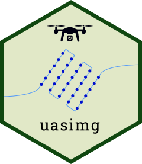

<!-- README.md is generated from README.Rmd. Please edit that file -->

<!-- badges: start -->
[](https://www.tidyverse.org/lifecycle/#experimental) [](https://ajlyons.r-universe.dev)
<!-- badges: end -->

```{r, echo = FALSE}
knitr::opts_chunk$set(
  collapse = TRUE,
  comment = "#>",
  fig.path = "README-"
)
```

<a href='http://ucanr-igis.github.io/uasimg'></a>`uasimg` helps manage images taken from an unoccupied aerial vehicle (UAV, or drone) that have been collected with the intent to stitch them into 2D and 3D products with photogrammetry software. The package does **not** stitch images, but helps you create catalogs of your image data, examine their locations and properties, export image centroids and estimated footprints as GIS files, convert formats, and create world files for individual images can be viewed in GIS software.

## Applications

`uasimg` was developed to help with the following common data management tasks:

1. Doing a quick check in the field of photos after a flight, assessing their locations and estimated image overlap. This can help a pilot determine if a flight was successful, or needs to be redone.

1. Subsetting images for further processing with photogrammetry (stitching) software like [Pix4Dmapper](https://www.pix4d.com/) or [OpenDroneMap](https://www.opendronemap.org/). Omitting images with an extreme amount of overlap can reduce processing time and improve results.

1. Creating individual Flight Summary pages in HTML, as the backbone of an image catalog, and higher level 'Table of Contents' pages for groups of related flights (e.g., from the same site).

1. Converting images from one format to another (e.g., DNG to JPG), while preserving all the image metadata needed for photogrammetry.

1. Creating world files for individual drone images, using the image EXIF data to model the ground footprint and rotation, so they can be imported in GIS software and appear in their approximate location.\
\
**Note**: image locations and footprints are based on the metadata saved in the image files (e.g., relative altitude above the launch point, camera compass direction), and are *estimates only*.

## Installation

`uasimg` is not on CRAN (yet), but you can install it from R-Universe:

```{r install_runiverse, eval=FALSE}
options(repos = c(ajlyons = 'https://ajlyons.r-universe.dev',
                  CRAN = 'https://cloud.r-project.org'))

install.packages('uasimg')
```

### Alternative Installation: GitHub

Alternately, you can install it from GitHub:

*Note*: Windows users need *RTools* to build packages from source files (which is basically what you do when you install from GitHub). RTools is not a R package, rather its a set of utilities that you install separately. You can download and install RTools from <https://cran.r-project.org/bin/windows/Rtools/>. Alternately, you can install RTools from within R by running:

```{r install_rtools, eval=FALSE}
install.packages('installr')
installr::install.Rtools()
```

After RTools is installed, install `uasimg` from GitHub with:

```{r install_uasimg, eval=FALSE}
## install.packages('remotes')
remotes::install_github("ucanr-igis/uasimg")
```

### Dependent Packages

`uasimg` requires several dependent packages, including *sf*, *dplyr*, *tidyr*, *leaflet*, *htmltools* and others (see the [DESCRIPTION](https://github.com/UCANR-IGIS/uasimg/blob/master/DESCRIPTION) file for a complete list). Normally missing packages are installed at the same time, but if you get an error message about a missing package(s), install the dependent packages separately (i.e., from the 'Packages' pane in RStudio) then run `remotes::install_github("ucanr-igis/uasimg", dependencies=FALSE)`. 

### exiftool

To read the EXIF data from the image files, `uasimg` requires an external command line tool called 'exiftool'.

**UPDATE: As of version 1.6.0, you no longer need to manually install the exiftool command line utility. Rather you can install by running:**

```{r install_exiftool, eval = FALSE}
exiftoolr::install_exiftool()
```

To verify it worked:

```{r exif_version}
exiftoolr::exif_version()
```

Alternately, you can install exiftool manually by downloading it from <http://www.sno.phy.queensu.ca/~phil/exiftool/>. Be sure to unzip it to a folder on the path (e.g, c:\\windows) and rename the executable file from *exiftool(-k).exe* to *exiftool.exe*.

## Supported Cameras

To see a list of known cameras (sensors), run ```uas_cameras()``` with no arguments. If your camera is not listed, you may submit an [issue](https://github.com/ucanr-igis/uasimg/issues) on GitHub to have it added, or pass the camera parameters in as a csv file. For details see the help page (```?uas_cameras```) or contact the package author.

## Data Requirements

Virtually all of the functions in `uasimg` use location data saved in the EXIF data (header) of image files themselves. This assumes the camera saves the location in the images using a GPS coordinate from the drone or the camera itself. To compute  footprints, the package also needs to know the above-ground height at which images were taken. Some drones (including many DJI drones) record the relative flight altitude (above the launch point) in the image file, but others don't (notably many multispectral cameras). Flight height can also be entered manually as an argument when you run `uas_info()`.

Requirements for `uasimg` therefore include:

 - images must have GPS coordinates saved in them   
 - image files should be grouped in folders (typically one flight per folder)
 - the camera must be one of the ones known by the `uasimg` package (see below)  

Additional requirements to generate estimated footprints:

 - the height above ground level must be saved in the image files, or passed as an argument. If passed as an argument, the assumption is that all images were taken from the same height.  
 - it is presumed that images were taken at nadir (camera pointing straight down)

# Usage Overview

You always start with `uas_info()`, feeding it one or more folders of drone images. This function extracts image information, computes footprints, and reads supplemental flight metadata. 

The object returned by `uas_info()` is not very useful by itself. The results are generally saved to a variable then fed into other functions that do useful things, such as:

- `uas_report()` creates 'Flight Summaries' as standalone HTML pages, with options to create image thumbnails ([sample](https://ucanr-igis.github.io/uasimg/samples/hrec/hrec_wtrshd2_2017_flt1_report.html)). Flight summaries also be grouped using `uas_toc()`, which generates a Table of Contents page for several Flight Summaries, with options to copy all the catalog files to a single folder so the catalog is in one place ([sample](https://ucanr-igis.github.io/uasimg/samples/hrec/index.html)).

- `uas_exp_shp()` and `uas_exp_kml()` exports flight geometries (image centroids, image footprints, and/or flight area) as Shapefiles or KML files. KML files can be imported into most flight planning software to refly the same area and/or plan a flight for an adjacent area.

- `uas_worldfile()` creates small external XML files that allow images to be imported into GIS software and appear in their approximate footprint.

- `uas_convert()` converts image files from one format to another.

- `uas_move()` moves images into a standardized directory tree based on metadata

For more info, see the [Managing Drone Images with uasimg](https://ucanr-igis.github.io/uasimg/articles/uasimg.html) Vignette and function help pages.

## Example

The general usage is to first create a flight info object for one or more directories of images using the *uas_info()* function. Save the result to a variable: 

```{r run_uas_info, eval=FALSE}
library(uasimg)
hast_ft1_info <- uas_info("c:/Drone_Projects/Hastingsx/Flt01_1443_1446_250ft")
```

If you want to record additional metadata about the flight as a whole, you can create a metadata.txt file in the image folder with `uas_metadata_make()`. Edit the metadata.txt file in Notepad (or another text editor), save it, then run `uas_info()` again. 

```{r uas_metadata_make, eval=FALSE}
uas_metadata_make(hast_ft1_info, open = TRUE)
```

Once a flight info object has been created, you can start to generate outputs.

```{r create_rpt, eval=FALSE}
## Generate a flight summary
uas_report(hast_ft1_info)

## Export image centroid, footprints, and minimum convex polygon as Shapefiles
uas_exp_shp(hast_ft1_info)

## Generate estimated world files so the images can be imported into ArcGIS or QGIS
uas_worldfile(hast_ft1_info)
```

# Utilities for Individual Images

The following utilities can help visualize and analyze individual images. These functions are based on the modeled image footprints, which as described above require the camera to record the relative altitude above ground. 

## World Files

Drone images typically save the coordinates of the camera, but do not include the width, length, or compass angle. A "world file" is a small external text file (also known as a *sidecar* file) that contains these additional parameters. These files allow GIS programs like ArcGIS Pro or QGIS to display the image in its approximate footprint on the ground. 

You can create world files, readable by ArcGIS and QGIS, with `uas_worldfile()`. `uas_worldfile()` can create three types of world files, including `aux.xml`, `jpw` and `tfw`, and `prj` files. `aux.xml` is the most recognized format and hence the default. See the `uas_worldfile()` help page for details.

## Cropping out the Center of Images

Sometimes images will simply not stitch, forcing you to do your analysis and visualization with individual images. `uas_cropctr()` crops out the center part of each image (which normally has the least amount of distortion if the image was taken at nadir). The function will also produce a world file for the cropped center, so they can be visualized together in a GIS software as a kind of crude mosaic. `uas_cropctr()` provides arguments to specify how tall and wide to make the crop, which you can set to the average forward distance between images and the average side distance between flight lines. The resulting mosaic will not be orthorectified, but may be good enough for visualization and/or object detection particularly if the area is flat.

# Get Involved!

## Bugs, Questions, and Feature Requests

To report a bug, add your camera to the package, or suggest a new feature, please create an [issue](https://github.com/ucanr-igis/uasimg/issues) on GitHub, or contact the package author.

## Code of Conduct

Please note that the uasimg project is released with a [Contributor Code of Conduct](http://ucanr-igis.github.io/uasimg/CODE_OF_CONDUCT.html). By contributing to this project, you agree to abide by its terms.

